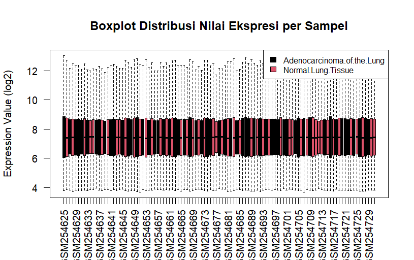
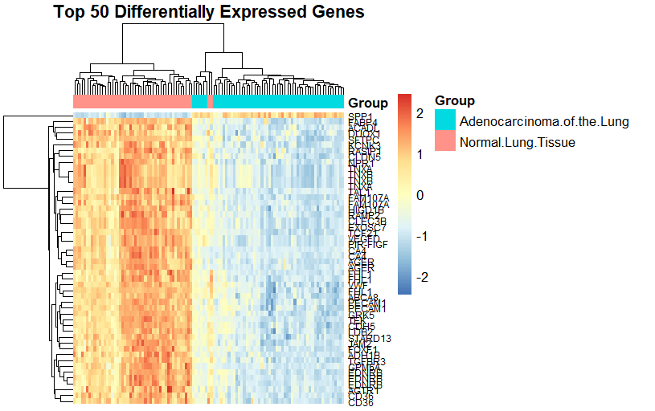

# Lung Adenocarcinoma Transcriptomic Analysis (GSE10072)

## Overview

This project presents a transcriptomic analysis of **lung adenocarcinoma** using the public microarray dataset **GSE10072** from the Gene Expression Omnibus (GEO).
The analysis aims to identify **differentially expressed genes (DEGs)** between lung adenocarcinoma tissue and normal lung tissue, followed by **functional enrichment analysis** to reveal the biological processes and pathways involved in lung cancer development.

The workflow includes data retrieval, preprocessing, statistical modeling using the **limma** framework, visualization of gene expression patterns, and **Gene Ontology (GO)** and **KEGG pathway enrichment analyses**.

---

## Dataset Information

| Attribute | Description                           |
| --------- | ------------------------------------- |
| Dataset   | GSE10072                              |
| Platform  | Affymetrix Human Genome U133A (GPL96) |
| Disease   | Lung Adenocarcinoma                   |
| Data Type | Microarray gene expression            |
| Source    | NCBI Gene Expression Omnibus (GEO)    |

Dataset link:
https://www.ncbi.nlm.nih.gov/geo/query/acc.cgi?acc=GSE10072

---

## Analysis Workflow

The analysis pipeline consists of the following steps:

1. **Data Retrieval**

   * Download dataset from GEO using `GEOquery`

2. **Preprocessing**

   * Extraction of expression matrix
   * Log2 transformation when necessary

3. **Sample Annotation**

   * Group assignment: tumor vs normal

4. **Differential Expression Analysis**

   * Linear modeling using **limma**
   * Empirical Bayes moderation
   * Identification of significant DEGs

5. **Gene Annotation**

   * Mapping Affymetrix probe IDs to gene symbols

6. **Visualization**

   * Boxplot distribution
   * Density distribution plot
   * UMAP dimensionality reduction
   * Volcano plot
   * Heatmap of top genes

7. **Functional Enrichment Analysis**

   * Gene Ontology (GO)
   * KEGG pathway analysis

---

## Visualization Results

### Expression Distribution

#### Boxplot of Gene Expression Values



The boxplot illustrates the distribution of gene expression values across all samples after preprocessing.

---

#### Density Distribution Plot


The density plot shows the overall distribution of gene expression values and allows comparison between biological groups.

---

### Sample Clustering

#### UMAP Plot


UMAP dimensionality reduction visualizes the global structure of the transcriptomic data and reveals separation between tumor and normal samples.

---

### Differential Expression

#### Volcano Plot


The volcano plot displays significantly **upregulated and downregulated genes** based on log fold change and adjusted p-values.

---

#### Heatmap of Top Differentially Expressed Genes



The heatmap highlights the expression patterns of the **top 50 most significant genes**, demonstrating clear clustering between lung cancer and normal samples.

---

### Functional Enrichment Analysis

#### Gene Ontology Enrichment (Upregulated Genes)

%20enrichment%20analysis%20of%20up-regulated%20genes.png)

Upregulated genes are significantly enriched in biological processes associated with **cell proliferation and tumor progression**.

---

#### Gene Ontology Enrichment (Downregulated Genes)

%20enrichment%20analysis%20of%20down-regulated%20genes.png)

Downregulated genes are associated with processes related to **cell structure and tissue organization**.

---

#### KEGG Pathway Enrichment (Upregulated Genes)


Key pathways enriched among upregulated genes include:

* Cell cycle
* p53 signaling pathway
* Protein digestion and absorption

These pathways are strongly associated with **tumor growth and genomic instability**.

---

#### KEGG Pathway Enrichment (Downregulated Genes)


Downregulated genes are enriched in pathways related to:

* Cytoskeleton organization
* Integrin signaling
* Focal adhesion

These pathways play important roles in **cell adhesion and structural integrity**.

---

## Tools and Packages

This analysis was conducted using the **R programming language** with the following packages:

* GEOquery
* limma
* hgu133a.db
* AnnotationDbi
* ggplot2
* pheatmap
* dplyr
* umap
* clusterProfiler
* org.Hs.eg.db
* enrichplot

---

## Key Output

The pipeline generates:

* Differential gene expression results
* Expression visualizations
* Functional enrichment analysis
* Biological interpretation of lung adenocarcinoma transcriptomic profiles

---

## Repository Structure

```
lung-adenocarcinoma-transcriptomic-analysis
│
├── README.md
├── scripts
│   └── DEG_analysis_pipeline.R
│
├── figures
│   ├── Boxplot.png
│   ├── Density distribution plot.png
│   ├── UMAP plot.png
│   ├── Volcano plot.png
│   ├── Heatmap.png
│   ├── GO enrichment figures
│   └── KEGG enrichment figures
│
└── results
    └── DEG_results.csv
```

---

## Author

Bioinformatics transcriptomic analysis project developed as part of a learning portfolio in **gene expression analysis and functional enrichment analysis using R**.

---
